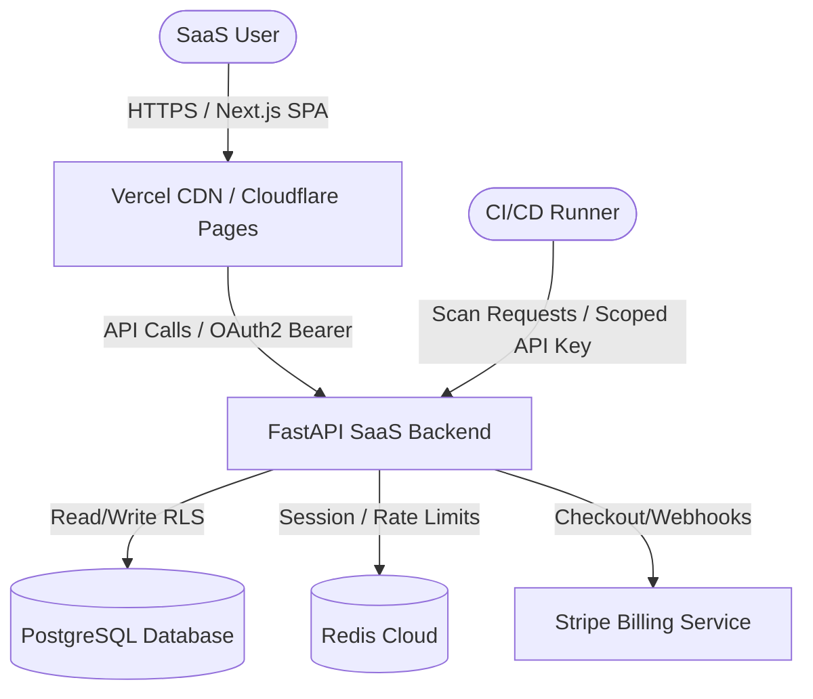

# ADR 0013: SaaS Architecture Plan for AgentGuard Platform

## Status
Proposed

## Context
As AgentGuard transitions from a local developer utility and self-contained CI scanner into a multi-tenant SaaS offering, we must define the platform architecture to support external customers, team collaboration, usage-based billing, enterprise authentication, and strict multi-tenant isolation.

This document details the architectural decisions and design strategies to guide Phase 9 cloud deployment.

---

## Architectural Decisions

### 1. Frontend / Backend Separation
- **Decision**: Decouple the user interface from the FastAPI application. Serve the Web Console as a standalone Single Page Application (SPA) using **Next.js (React)**, hosted on a global CDN (e.g., Vercel, Netlify, or Cloudflare Pages).
- **Rationale**: Decoupling the frontend optimizes page delivery, facilitates independent developer velocities, minimizes API load, and supports CDN-side edge rendering/caching.
- **Protocol**: Communication with the FastAPI backend occurs over standard JSON REST APIs. All endpoints will enforce strict Cross-Origin Resource Sharing (CORS) rules restricting access to approved origin domains.

### 2. Authentication and SSO Strategy
- **Decision**: Adopt a hybrid authentication model:
  - **Human Users**: Outsource user registration, email verification, passwords, and Enterprise Single Sign-On (SSO) / SAML to a specialized Identity Provider (IdP) such as **Clerk**, **Auth0**, or **Supabase Auth**.
  - **API Scanners / Daemons**: Retain AgentGuard's content-addressed, SHA-256 hashed **Scoped API Keys** issued via the console.
- **Authentication Handshake**:
  - The frontend exchanges Clerk/Auth0 credentials for a JWT token.
  - The JWT is sent via the `Authorization: Bearer <JWT>` header to FastAPI.
  - FastAPI validates the signature against the IdP's JWKS (JSON Web Key Set) public endpoint.

### 3. Multi-Tenancy Isolation
- **Decision**: Retain a **Shared Database, Shared Schema** multi-tenant model using PostgreSQL **Row-Level Security (RLS)**.
- **RLS Guardrails**:
  - Every tenant-associated database record contains an `organization_id` column.
  - API requests bind `app.current_org_id` inside a transaction block.
  - Postgres RLS filters enforce that queries automatically hide rows belonging to other organizations.
- **No-Leaks Policy**: Ensure that `organization_id` context is cleared at request end via ASGI middleware to prevent transaction pool leakage.

### 4. Billing Readiness & Stripe Integration
- **Decision**: Integrate **Stripe** to govern subscriptions and usage-based scan quotas.
- **Billing Strategy**:
  - **Tiers**: Introduce Free (up to 50 scans/month), Team (up to 1,000 scans/month), and Enterprise (unlimited + custom scenarios).
  - **Usage Tracking**: Increment Prometheus counters on successful evaluation scans and log records to track organizational scan volume.
  - **Enforcement**: Middleware queries the tenant's cache value for `scans_remaining` before initiating `/runs`. If zero, returns `402 Payment Required` (with Stripe billing redirect link).
  - **Stripe Webhooks**: Capture subscription creations, updates, upgrades, and cancellations to instantly update cached usage permissions.

---

## Security Implications
1. **SSO Federations**: Enables enterprise customers to map their Active Directory / Okta groups to AgentGuard scopes (`admin`, `read`, `write`, `scan`).
2. **Secrets Rotation**: Enforces JWT expiration checks (max 1 hour) for console sessions, keeping long-lived credentials restricted exclusively to highly monitored CI/CD environments.
3. **Data Residency**: Future compliance might require migrating from Postgres RLS to Database-per-tenant for selective enterprise accounts requesting local hosting. The clean frontend-backend split facilitates database migrations without frontend code changes.
