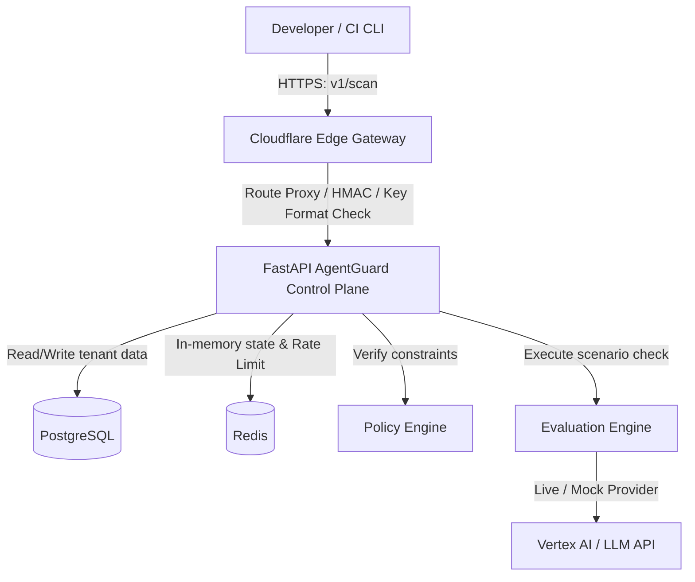

# Production Deployment Architecture

This document describes the production-grade deployment layout and requirements for AgentGuard.

---

## 1. Architecture Flow Diagram

---

## 2. Infrastructure & Component Breakdown

### A. Edge Gateway Layer (Cloudflare Workers)
- **Role**: Edge proxy routing, fast input validation (regex checks on API keys), and GitHub Webhook authentication (HMAC verification).
- **Production Status**: Production-ready. Stateless, zero-cold-start edge execution.
- **Required Secrets**:
  - `GITHUB_WEBHOOK_SECRET`: HMAC key to authenticate GitHub webhook payloads.
  - `GITHUB_TOKEN`: Read contents permission to fetch `manifest.json`.
  - `AGENTGUARD_API_KEY`: Key to authorize scans forwarded to the backend.

### B. Control Plane (FastAPI Web App)
- **Role**: Core registry, policy management, evaluation run execution, and SaaS onboarding endpoints.
- **Production Status**: Production-ready. Run inside Docker containers scaled across a container runner (e.g. AWS ECS, GCP Cloud Run, Kubernetes).
- **Required Secrets & Config**:
  - `DATABASE_URL`: Connection string to PostgreSQL.
  - `REDIS_URL`: Connection string to Redis.
  - `SECRET_KEY`: Used for signing verification tokens and sessions.
  - `API_KEY_HASH_SECRET`: Used as a pepper/salt to secure API key verification hashes.
  - `LOG_LEVEL`: Log level constraints (e.g. `INFO`).

### C. Database Layer (PostgreSQL)
- **Role**: Relational store with strict multi-tenant isolation enforced via Row-Level Security (RLS) on `organizations`, `agents`, `eval_runs`, `eval_results`, `usage_events`, and `plans`.
- **Production Status**: Requires a managed database service (e.g., AWS RDS, GCP Cloud SQL) with PGVector extension enabled.

### D. Caching & Rate Limiting Layer (Redis)
- **Role**: Rate limiting token buckets and distributed locks.
- **Production Status**: Requires a managed Redis service (e.g., AWS ElastiCache, GCP Memorystore, or serverless Upstash).
