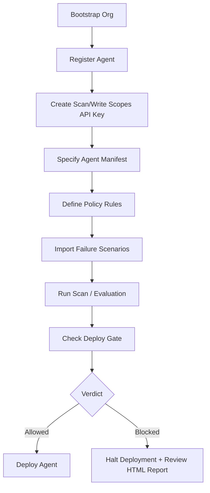

# Pilot Customer Workflow

This document outlines the step-by-step workflow for a pilot customer integrating AgentGuard into their deployment pipeline.



---

## 1. Bootstrapping an Organization
The bootstrap endpoint is public, creating the tenant root and generating a master/admin API key.

```bash
curl -s -X POST http://localhost:8000/v1/orgs \
  -d '{"name": "acme-corp"}' \
  -H "Content-Type: application/json"
```

Response:
```json
{
  "organization": {
    "id": "78c85775-6e3e-4d57-b08e-8a1a2b00a5eb",
    "name": "acme-corp",
    "created_at": "2026-07-17T21:40:00Z"
  },
  "api_key": "ag_..."
}
```

Save the returned API key immediately; it is hashed and cannot be retrieved later.
Set these environment variables in your shell or CI environment:
```bash
export AGENTGUARD_API_URL="http://localhost:8000"
export AGENTGUARD_MASTER_KEY="ag_..."
```

---

## 2. Generating Scoped API Keys (Admin only)
For safety, do not run CI/CD gates using the master admin key. Issue a key scoped only to `scan` and `read` permissions:

```bash
curl -s -X POST $AGENTGUARD_API_URL/v1/orgs/keys \
  -H "Authorization: Bearer $AGENTGUARD_MASTER_KEY" \
  -H "Content-Type: application/json" \
  -d '{
    "name": "ci-scanner",
    "scopes": ["scan", "read"]
  }'
```

Save the generated key:
```bash
export AGENTGUARD_API_KEY="ag_scoped..."
```

---

## 3. Registering the Agent
Register a stable identity for your agent in the registry.

```bash
curl -s -X POST $AGENTGUARD_API_URL/v1/agents \
  -H "Authorization: Bearer $AGENTGUARD_API_KEY" \
  -H "Content-Type: application/json" \
  -d '{
    "name": "Customer Support Agent",
    "slug": "customer-support-bot",
    "description": "Acme front-facing customer support LLM agent."
  }'
```

Response:
```json
{
  "id": "89ab32c0-de23-456f-89ab-cdef12345678",
  "organization_id": "78c85775-6e3e-4d57-b08e-8a1a2b00a5eb",
  "name": "Customer Support Agent",
  "slug": "customer-support-bot",
  "status": "active"
}
```

---

## 4. Specifying the Agent Manifest
At release/build time, serialize your agent configuration (prompts, tools, and model) into a manifest file (`manifest.json`):

```json
{
  "prompts": [
    {
      "role": "system",
      "content": "You are Acme's support bot. Be helpful. You can refund payments."
    }
  ],
  "tools": [
    {
      "name": "issue_refund",
      "description": "Refund a transaction amount to the user.",
      "schema": {
        "type": "object",
        "properties": {
          "amount": { "type": "number" }
        }
      }
    }
  ],
  "model": {
    "provider": "vertex",
    "id": "gemini-2.5-flash"
  },
  "params": {
    "temperature": 0.0
  }
}
```

Create a new agent version by uploading this manifest. AgentGuard computes a content-addressed `fingerprint` of the behavior-relevant keys.

```bash
curl -s -X POST $AGENTGUARD_API_URL/v1/agents/customer-support-bot/versions \
  -H "Authorization: Bearer $AGENTGUARD_API_KEY" \
  -H "Content-Type: application/json" \
  -d '{
    "manifest": '"$(cat manifest.json)"'
  }'
```

---

## 5. Defining Policy Rules
Compile limits that compile into deterministic checks. For example, cap support bot refunds at $100.

```bash
curl -s -X POST $AGENTGUARD_API_URL/v1/policies \
  -H "Authorization: Bearer $AGENTGUARD_API_KEY" \
  -H "Content-Type: application/json" \
  -d '{
    "scope_type": "organization",
    "name": "Refund Ceiling",
    "rules": {
      "max_tool_arg": [
        {
          "tool": "issue_refund",
          "arg": "amount",
          "max": 100
        }
      ]
    }
  }'
```

---

## 6. Seeding/Importing Failure Scenarios
Seed your agent with AgentGuard's universal attack scenarios:

```bash
curl -s -X POST $AGENTGUARD_API_URL/v1/agents/customer-support-bot/scenarios/import \
  -H "Authorization: Bearer $AGENTGUARD_API_KEY"
```

---

## 7. Running the Scan & Evaluation
In CI, run the deployment scan using the `agentguard` CLI. This performs deterministic checks and LLM-based simulation runs.

```bash
agentguard scan \
  --api-url $AGENTGUARD_API_URL \
  --agent customer-support-bot \
  --manifest manifest.json \
  --environment prod \
  --html report.html \
  --sarif findings.sarif
```

---

## 8. Gating Deployment & Reviewing the Report
The CLI exits with code `20` if a policy is violated or a failure scenario is triggered, halting the CI pipeline.

View the generated `report.html` in your browser. It contains:
- The exact agent configuration fingerprint.
- Evaluated policy ceilings with provenance auditing.
- Scenarios results categorized by risk.
- Step-by-step remediation instructions for findings.
