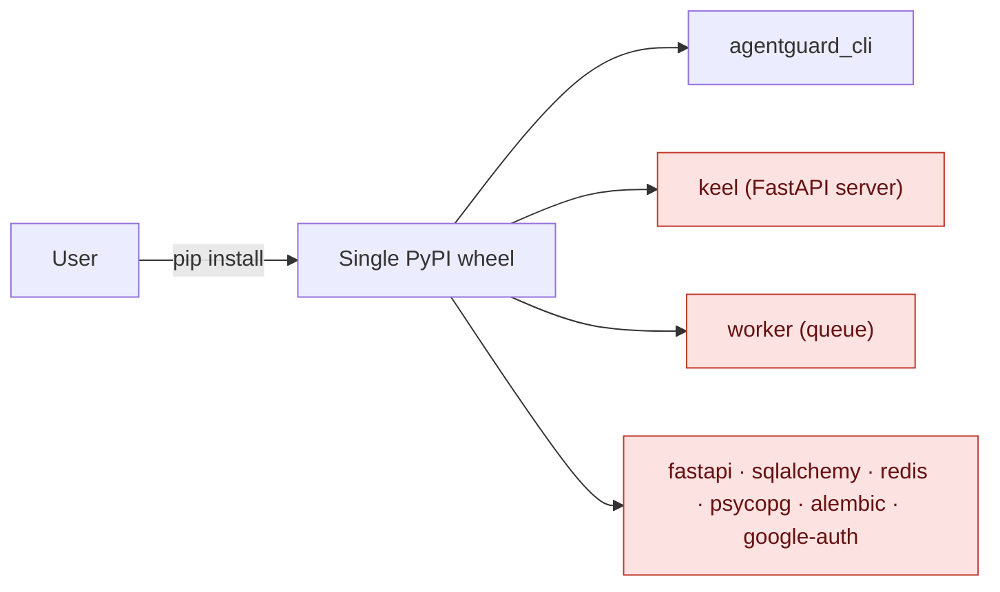
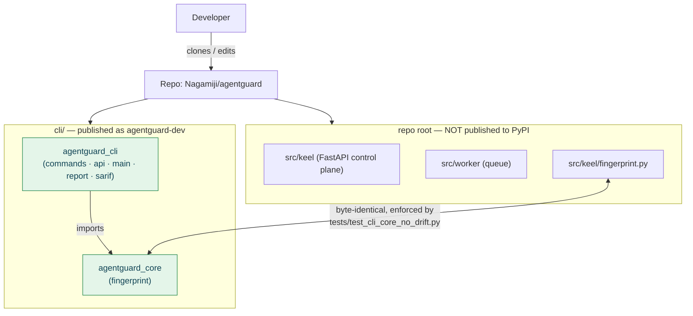
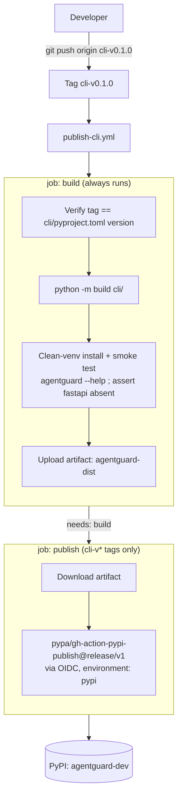
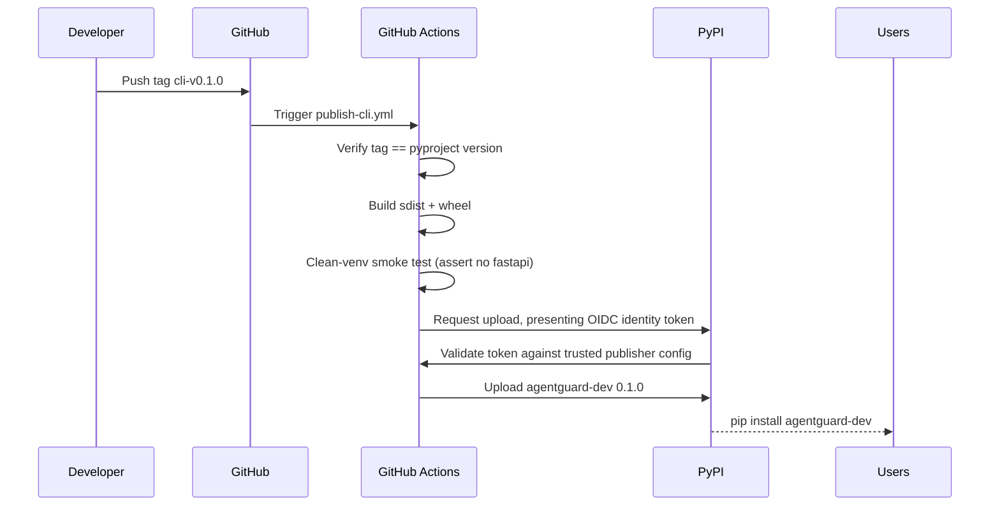
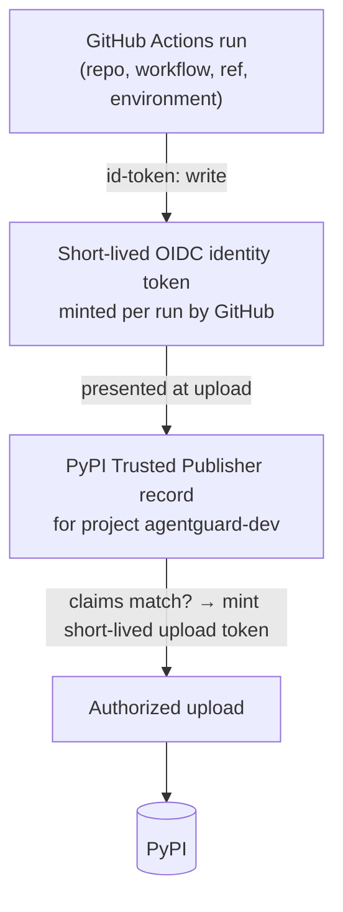

# AgentGuard CLI — Packaging, Release & Publishing Architecture

> Audience: engineers who need to understand, extend, or cut a release of the AgentGuard
> CLI. This is a design document, not a changelog. It explains *why* the CLI is a separate
> PyPI distribution, how the wheel is kept minimal, how CI/CD publishes it with **no stored
> secrets**, and exactly how to ship the next version.

**Status:** `agentguard-dev` **0.1.0** is live: <https://pypi.org/project/agentguard-dev/>
**Source of truth for these claims:** `cli/pyproject.toml`, `.github/workflows/publish-cli.yml`,
`tests/test_cli_core_no_drift.py`, and the wheel metadata (`Requires-Dist: httpx>=0.27`).

---

## 1. Overview

### What the AgentGuard CLI is

`agentguard` is the **deployment gate** a developer runs in CI. It evaluates an agent
version against its scenarios and policy by calling an AgentGuard control plane over HTTP,
prints the verdict, optionally emits SARIF / an HTML report, and — crucially — **exits
non-zero when a deploy must be blocked**. That exit code is the entire product contract:

```
exit 0  → allowed        exit 20 → blocked
exit 10 → error (fail closed)   exit 30 → unknown (fail closed by default)
```

The CLI is a *thin API client by design*. It holds no database, runs no server, and
executes no agent tools. Its only non-stdlib runtime dependency is `httpx`.

### Install and run

```bash
pip install agentguard-dev
agentguard --help
```

### Three names that are deliberately different

This trips people up, so it is stated explicitly. A Python project has **three independent
namespaces**, and AgentGuard uses all three differently on purpose:

| Concept | Value | Where it is defined | Who sees it |
| --- | --- | --- | --- |
| **Distribution name** (PyPI) | `agentguard-dev` | `cli/pyproject.toml` → `[project].name` | `pip install agentguard-dev` |
| **Import packages** (Python) | `agentguard_cli`, `agentguard_core` | directory names under `cli/src/` | `import agentguard_cli` |
| **Executable** (console script) | `agentguard` | `[project.scripts]` entry point | the command you type |

Why they differ:

- **Distribution name ≠ import name** is normal and supported by Python packaging (PEP 508 /
  PEP 427). PyPI distribution names are a *single flat global namespace* — collisions and
  name reservations are common — whereas import names only need to be unique within an
  environment. Decoupling them lets the published name change (`agentguard` →
  `agentguard-dev`) **without touching a single `import` statement or breaking users' code**.
- **Executable = `agentguard`** keeps the ergonomics the product promises (`agentguard scan
  …`) regardless of what the distribution is called on PyPI. The command is the UX; the
  distribution name is a registry key.
- Note the PEP 427 filename normalization: the `agentguard-dev` distribution builds a wheel
  named `agentguard_dev-0.1.0-py3-none-any.whl` (hyphen → underscore). CI globs account for
  this (§6).

---

## 2. The problem before the split

Originally there was **one** `pyproject.toml` at the repository root that built **one**
distribution from everything under `src/`. Package discovery was unfiltered:

```toml
# the original root pyproject.toml (before the split)
[tool.setuptools.packages.find]
where = ["src"]           # ← discovers EVERY package under src/: keel, worker, agentguard_cli
```

and the runtime dependency list was the *server's* dependency list:

```toml
dependencies = [
  "fastapi", "uvicorn[standard]", "sqlalchemy", "alembic",
  "psycopg[binary]", "redis", "google-auth", "httpx", ...
]
```

The consequences, confirmed by building the wheel and inspecting it:

- **The wheel shipped the backend.** `top_level.txt` contained `agentguard_cli`, **`keel`**,
  and **`worker`** — the FastAPI control plane, ORM models, migrations-adjacent code, the
  evaluation engine, and the queue worker were all published to PyPI.
- **Heavy dependencies leaked to CLI users.** A plain `pip install` pulled the full server
  stack — a **~107 MB / ~40-package** install for a tool whose only real need is `httpx`.
- **Distribution was coupled.** The CLI could not be versioned, described, or released
  independently of the backend, and every CLI install exposed server internals.



Everything in red had no business being in a developer's CLI environment. The fix was to
stop shipping it — not to document around it.

---

## 3. The new architecture

The CLI became its **own distribution** rooted at `cli/`, containing exactly two import
packages and depending only on `httpx`. The backend keeps living at the repo root
(`src/keel`, `src/worker`) and is **never** part of the CLI wheel.



Key properties:

- **The CLI is standalone.** It imports only `agentguard_cli` and `agentguard_core`; it never
  imports `keel` or `worker`. A wheel install therefore needs none of the server stack.
- **The backend stays separate.** `src/keel` and `src/worker` are developed and deployed as
  before (as a container image, not via `pip`), unaffected by the CLI's packaging.
- **The fingerprint is duplicated on purpose, and synchronized by a test.** See §4 for why
  duplication (not a shared import) is the correct call here.

### Why the CLI needs `agentguard_core` at all

The CLI must compute an agent manifest's **fingerprint locally** (for `agentguard
fingerprint`, and to attach a verdict to an exact configuration). The fingerprint algorithm
is domain logic that the *server* also owns (`src/keel/fingerprint.py`). If the CLI simply
imported it from `keel`, the CLI wheel would once again depend on the backend package — the
exact coupling we removed.

The resolution: the fingerprint implementation lives in **`agentguard_core/fingerprint.py`**
(pure standard library — `hashlib`, `json`, `re`), and `src/keel/fingerprint.py` holds a
**byte-identical copy** for the server. A regression test (`tests/test_cli_core_no_drift.py`)
fails CI the moment the two files differ, so "two copies" can never silently become "two
behaviours."

> **Why copy instead of share?** A shared third distribution would be the textbook answer,
> but it would mean publishing and versioning a second package and adding a dependency edge
> to *both* the CLI and the server for one small, stable, stdlib-only module. The drift test
> buys the same guarantee (identical fingerprints) at a fraction of the operational cost. If
> `agentguard_core` grows beyond fingerprinting, revisit this and promote it to a shared
> distribution.

---

## 4. Package contents

The built `agentguard-dev` wheel contains exactly two import packages and nothing else:

```
agentguard-dev (wheel: agentguard_dev-0.1.0-py3-none-any.whl)
│
├── agentguard_cli/
│   ├── __init__.py     # package version; the CLI's docstring/contract
│   ├── main.py         # argparse entry point → dispatches subcommands, sets the exit code
│   ├── commands.py     # command implementations (scan, report, policy, fingerprint, init)
│   ├── api.py          # thin httpx-based client for the control-plane API
│   ├── report.py       # self-contained, fully-escaped HTML report renderer
│   └── sarif.py        # SARIF 2.1.0 emitter (findings land in the PR)
│
└── agentguard_core/
    ├── __init__.py
    └── fingerprint.py  # canonical manifest → content-hash fingerprint (stdlib only)
```

Folder responsibilities:

- **`agentguard_cli/`** — everything the *command* does: parse arguments, call the API,
  render output (text / JSON / SARIF / HTML), and translate a verdict into the CI exit code.
  It is deliberately I/O-thin: no business rules about *what is safe* live here (that is the
  server's job); the CLI's contract is "call the API, report, and gate."
- **`agentguard_core/`** — logic the CLI must run **locally and identically to the server**.
  Today that is exactly the fingerprint. Kept as its own package so the CLI/server drift
  boundary is explicit and testable.

Note what is **not** here: no `main.py` server, no models, no `keel`, no `worker`.

---

## 5. Dependency isolation

### Declared runtime dependency (the whole list)

```toml
# cli/pyproject.toml
dependencies = ["httpx>=0.27"]
```

### Explicitly NOT included

The following are backend concerns and must never appear in the CLI wheel or its dependency
closure:

```
fastapi          uvicorn         sqlalchemy      alembic
psycopg / postgres    redis      google-auth     the worker / backend services
```

### How this is verified

Two independent checks, both cheap enough to run on every release:

```bash
# 1. What packages are actually inside the wheel?
unzip -l cli/dist/agentguard_dev-0.1.0-py3-none-any.whl
#    → expect only agentguard_cli/ and agentguard_core/ ; grep must find no keel|worker

# 2. What does a clean install actually pull in?
python -m venv /tmp/ag && /tmp/ag/bin/pip install cli/dist/agentguard_dev-0.1.0-py3-none-any.whl
/tmp/ag/bin/pip list        # → agentguard-dev + httpx (+ httpx's small transitive deps) only
```

CI encodes the second check as a hard gate: after installing the freshly built wheel, the
workflow runs `pip show fastapi` and **fails the release** if it succeeds (§6). The dependency
boundary is thus not a convention — it is enforced by the pipeline.

### Why this matters

- **Install size and speed.** ~17 MB vs ~107 MB; seconds vs minutes; friendlier in CI images
  and constrained environments.
- **Attack surface & supply chain.** Every dependency a CLI pulls is code that runs in the
  user's CI. `httpx` alone is a far smaller surface than a database driver + web framework.
- **No accidental disclosure.** Server internals are never shipped to a public index.

---

## 6. Build & publish pipeline

Releases are triggered by pushing a **`cli-v*`** tag. The workflow
`.github/workflows/publish-cli.yml` builds, smoke-tests, and (only for a real tag) publishes.



What each stage guarantees:

- **Verify tag matches version.** `cli-v0.1.0` must equal `cli/pyproject.toml`'s `version`, or
  the job errors. This makes it impossible to tag `cli-v0.1.1` while the metadata still says
  `0.1.0` — the tag and the artifact can never disagree.
- **Build.** `python -m build cli/` produces the sdist and wheel from the `cli/` project only.
- **Smoke test in a clean venv.** Installs the built wheel, runs `agentguard --help`, then
  asserts `fastapi` is **not** installed. The install glob is `agentguard*.whl` — deliberately
  broad so it matches the normalized `agentguard_dev-*.whl` filename (see §1).
- **Publish.** Runs **only** on a `cli-v*` tag, in the `pypi` GitHub environment, with
  `id-token: write`. No token is read; authentication is OIDC (§7).

The as-run sequence:



---

## 7. Trusted Publishing security model (PyPI + OIDC)

**No API token is stored anywhere.** The pipeline uses PyPI **Trusted Publishing**, which
authenticates the *workflow itself* via short-lived OpenID Connect (OIDC) identity tokens.



Why this is preferred over an API token:

- **No stored secrets.** There is no PyPI token in repo secrets, in the workflow, or on any
  developer's machine. Nothing to leak, rotate, or accidentally commit.
- **No long-lived credentials.** The OIDC token is minted per run and expires in minutes; the
  upload token PyPI returns is equally short-lived.
- **Identity-bound, not password-bound.** Upload rights are tied to *a specific repository,
  workflow file, and environment* — not to a person or a shared password. An attacker would
  need to run *this workflow in this repo*, which the branch/tag and review controls govern.
- **Auditable.** Each publish traces to a specific GitHub Actions run and git tag.

### Trusted Publisher configuration (one-time, on PyPI)

Set under *PyPI → project → Publishing* (or as a **pending publisher** before the project's
first upload). The values must match the workflow exactly or PyPI rejects the OIDC token:

```
PyPI project name : agentguard-dev
Owner             : Nagamiji
Repository name   : agentguard
Workflow filename : publish-cli.yml
Environment name  : pypi
```

> The environment name **must** be `pypi` because the workflow's `publish` job declares
> `environment: pypi`. A mismatch here is the most common cause of a first-publish failure.

---

## 8. Release process

Cutting a new CLI release is deliberately small and automated.

### Steps

1. **Bump the version** in `cli/pyproject.toml`:

   ```toml
   [project]
   version = "0.1.1"
   ```

2. **Open a PR and merge it** to `main` after review. (`main` is protected — it only ever
   changes via a squash-merged PR; see `CLAUDE.md` and `docs/branch-protection.md`. Never
   commit or push to `main` directly.)

3. **Tag the merged commit** on `main`, matching the version, in the `cli-v*` namespace:

   ```bash
   git tag cli-v0.1.1
   git push origin cli-v0.1.1
   ```

   The `cli-v*` namespace is intentionally separate from the platform's own `v*` tags so the
   two release cadences never collide. The workflow verifies `cli-v0.1.1` == the pyproject
   version and will fail the tag if they differ.

4. **GitHub Actions publishes automatically** via OIDC — no manual upload, no token.

5. **Verify from PyPI** in a clean environment:

   ```bash
   python -m venv /tmp/verify && /tmp/verify/bin/pip install agentguard-dev==0.1.1
   /tmp/verify/bin/agentguard --version   # → agentguard 0.1.1
   /tmp/verify/bin/agentguard --help
   ```

### Rules and gotchas

- **A published version is immutable.** PyPI does not allow re-uploading the same
  version — you can only *yank* it. Get the wheel right *before* tagging (that is what the
  build + smoke-test job is for). Do not tag speculatively.
- **Tag the reviewed commit.** The tag should point at merged code on `main`, not at a
  feature branch.
- **Distribution name is fixed to `agentguard-dev`.** Changing the distribution name is a new
  project on PyPI and needs its own trusted-publisher record; it is not a routine release.

---

## 9. Testing & validation strategy

Every layer that could regress has a check.

| Layer | Command / test | What it protects |
| --- | --- | --- |
| Package metadata | `python -m build cli/` then `twine check dist/*` | Buildable sdist+wheel; valid, renderable metadata |
| Wheel contents | `unzip -l cli/dist/*.whl` | Only `agentguard_cli` + `agentguard_core`; no `keel`/`worker` |
| Dependency isolation | clean-venv install + `pip show fastapi` must fail | Server stack never enters the CLI closure (CI-gated) |
| CLI behavior | `agentguard --help`, `agentguard scan --help`, `agentguard fingerprint <file>` | The command runs standalone on `httpx` alone |
| CLI/server parity | `pytest tests/test_cli_core_no_drift.py` | `agentguard_core` and `keel` fingerprints are byte-identical |
| Backend regression | `pytest` (repo root) | The split didn't break the control plane |

Representative commands:

```bash
# Build + metadata
cd cli && python -m build && python -m twine check dist/*

# Wheel inspection (expect no keel|worker)
unzip -l dist/*.whl | grep -E "keel|worker" || echo "clean"

# Clean install + CLI smoke test
python -m venv /tmp/test-env
/tmp/test-env/bin/pip install dist/*.whl
/tmp/test-env/bin/agentguard --help
/tmp/test-env/bin/agentguard scan --help

# Drift + backend regression (from repo root)
.venv/bin/pytest tests/test_cli_core_no_drift.py
.venv/bin/pytest
```

---

## 10. Lessons learned

- **Ship the CLI as its own distribution.** Bundling it with the backend leaked server code
  and a heavy dependency tree to every CLI user. Isolation is the default, not an afterthought.
- **Scope package discovery explicitly.** Unfiltered `packages.find` over `src/` is how the
  backend ended up in the wheel. `include = [...]` (and building from a dedicated `cli/`
  project) makes "what ships" a deliberate decision, not a side effect.
- **Enforce the dependency boundary in CI.** "The CLI must stay lightweight" is only true if a
  job fails when it isn't. The `pip show fastapi` gate turns a principle into a guarantee.
- **Prefer Trusted Publishing over API tokens.** No stored secret, no long-lived credential,
  identity-bound and auditable. A token pasted into a chat or committed to a file is a leak;
  OIDC removes the token entirely.
- **Distribution names are a global namespace — expect collisions.** Decoupling the PyPI name
  (`agentguard-dev`) from the import names and the executable meant a rename cost *zero* code
  changes. Keep those three namespaces independent.
- **Duplicate-with-a-drift-test can beat a shared dependency** for a small, stable module —
  but only because a test makes the duplication safe. Without `test_cli_core_no_drift.py`, two
  copies would be a latent correctness bug.
- **Validate the wheel before tagging.** Published versions are immutable; the cheap
  `build`/`twine check`/`unzip`/clean-install loop is what keeps a bad artifact from becoming
  a permanent one.

---

## References

- `cli/pyproject.toml` — the CLI distribution definition (name, deps, entry point, discovery)
- `.github/workflows/publish-cli.yml` — build, smoke-test, OIDC publish
- `tests/test_cli_core_no_drift.py` — CLI/server fingerprint parity guard
- `docs/deployment-gate.md` — using the CLI as a CI gate (exit-code contract, SARIF, Action)
- `docs/branch-protection.md` — why `main` only changes via reviewed, squash-merged PRs
- PyPI project: <https://pypi.org/project/agentguard-dev/>
