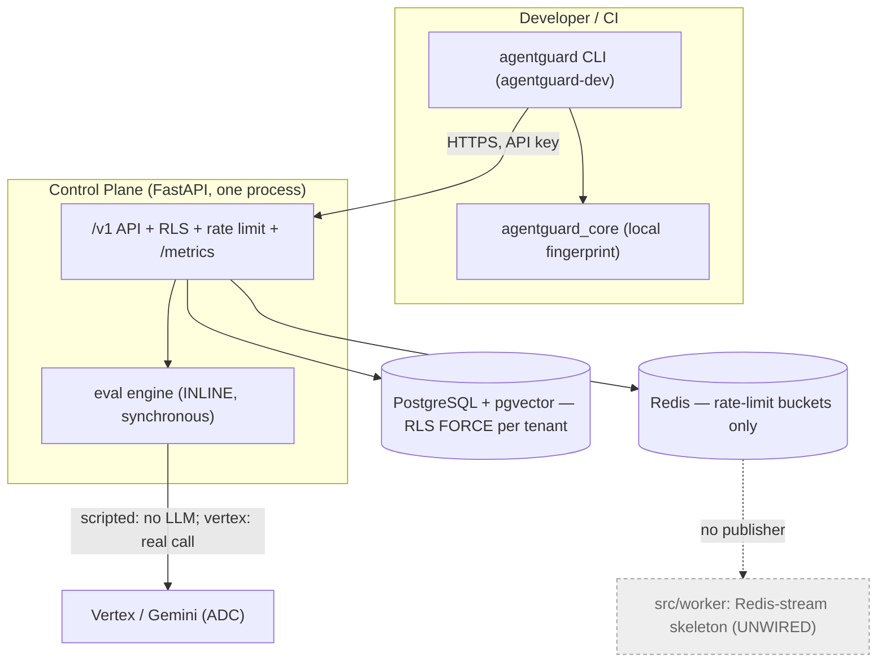
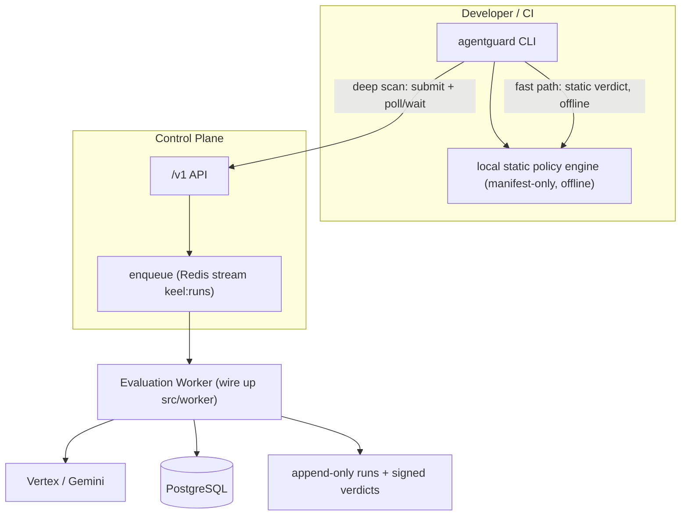

# AgentGuard — Technical Founder Review & Engineering Plan

_2026-07-18. A grounded review: every load-bearing claim verified against the actual code,
not against the prior audit's assumptions. Supersedes the stale architecture picture in some
of `docs/production-readiness.md` (dated 2026-07-17)._

---

## 0. Reality corrections (the audit's map ≠ the territory)

Five widely-repeated "facts" about AgentGuard are wrong or stale. Verified in code:

| Claim | Reality (verified) | Evidence |
|---|---|---|
| A Cloudflare edge worker sits between CLI and API | **No Cloudflare component in the request path.** Only `cloudflare_token: str = ""` in `config.py` (a deploy credential). CLI → FastAPI directly. | `grep -ri cloudflare src/` |
| Redis/Celery workers run evaluations | **No Celery.** `src/worker/main.py` is a Redis-stream (`keel:runs`) consumer **skeleton**; *nothing publishes to the stream*. Unwired. | `grep -rn "keel:runs\|xadd" src/keel` |
| Evaluation is async (worker → LLM) | **Scans run inline, synchronously** in the request handler. | `src/keel/api/evals.py` `create_run` → `run_scenario` |
| DX proposal: "add `agentguard init`" | **Already exists** — scaffolds manifest + policy + CI workflow. | `cli/src/agentguard_cli/commands.py:250` |
| Top-3 GA gaps (metrics/RBAC/rate-limit) open | **All three shipped** since 2026-07-17. | `metrics.py`, `rate_limit.py`, `roles.py`, `tests/test_rbac.py`, `tests/test_rate_limiting.py` |

**Net:** the real system is simpler and more synchronous than assumed, and further along on
observability/limits/RBAC. That reframes the plan from "cloud-scale redesign" to "high-impact
refinement of the CLI↔engine relationship."

---

## 1. Executive summary

**Maturity: strong pilot, not GA.** The thesis is demonstrable (a live Gemini model obeys a
prompt injection and attempts a $9k refund; AgentGuard blocks the deploy *without executing
tools*). The hard-to-get-right foundations are genuinely solid: tenant isolation (RLS FORCE,
tested per table), auth (256-bit hashed keys), secrets hygiene, tested migrations, fail-closed
exit codes, and no-real-execution as a *structural* property. The CLI is cleanly separated
(`agentguard-dev`, httpx-only) and published via OIDC Trusted Publishing.

**Biggest risks (ranked):**
1. **Synchronous eval on the request path** — a real Vertex scan holds an HTTP connection
   open; no job model, retry, or backpressure. Caps scale *and* reliability.
2. **Verdict forgeability by any secret-holder** — HMAC signing (opt-in) means the platform or
   anyone with `KEEL_SIGNING_SECRET` can mint a "pass." For a deploy gate that is the property
   that matters most.
3. **Unauthenticated, unthrottled tenant creation minting `*` keys** — see §3 (S7). Surfaced by
   the RBAC audit; arguably the biggest pre-GA abuse vector.
4. **Rate-limit fail mode unverified** — a cost control that fails open under load is no control.

**Biggest opportunities (ranked):** (1) local static policy pre-check offline (`scan --local`)
— the adoption unlock; (2) framework manifest auto-generation (LangChain first); (3)
supply-chain provenance (Sigstore/SLSA) — cheap and on-brand.

---

## 2. Architecture review

### Current (corrected to reality)



### Recommended near-term (local static + remote dynamic + real worker)



**Answers:**
- *CLI too API-dependent?* Partially, and it's the main adoption drag: only `fingerprint` is
  offline; `scan`/`policy`/`report` need the API — yet a chunk of policy is **static and
  manifest-only** (disallowed provider/model/tool, `max_tool_arg`) and could run locally.
- *Meaningful local checks?* Only fingerprinting today; a static tier changes that.
- *Network assumptions?* Gate is fail-closed (exit 10 on API error) — safe but brittle (CI
  hard-fails if the API is down). A local static tier gives a meaningful answer during outages.
- *Cloudflare coupling?* **None in the data path** — don't spend effort decoupling from a
  non-dependency.

**Tradeoff:** a local static "PASSED" could be mistaken for full safety; the value is the
*dynamic* simulation. Mitigate by labeling verdicts `PASSED (static only)`.

---

## 3. Security assessment (updated with the RBAC audit, §Appendix A)

| # | Finding | Severity | Detail | Remediation |
|---|---|---|---|---|
| S1 | Verdict forgeable by secret-holder | **High** | HMAC-SHA256, opt-in (`None` if unset → verdicts may be unsigned). No third-party verifiability. | Ed25519 alongside HMAC; JWKS endpoint; CLI verifies offline; dual-sign during migration. |
| **S7** | **Unauthenticated + unthrottled tenant creation minting `*` keys** | **Med now / High GA** | `POST /orgs` (documented gap) and `POST /onboarding` (undocumented, "self-serve") both create an org + `["*"]` key with no auth, no rate limit. Abuse = unbounded orgs/keys, resource + cost exhaustion. | Gate `/onboarding` (signup/CAPTCHA/provisioning secret) + `rate_limited("onboarding")`; issue a scoped, not `*`, initial key; add the security note `bootstrap_org` already carries — or remove until gated. |
| S3 | Rate-limit fail mode unverified | **Medium** | Redis token-bucket is sound; behavior when Redis is unreachable is unconfirmed. Fail-open = no control under attack. | Confirm and make fail-**closed** (or conservative static ceiling); add `agentguard_limiter_errors_total` + alert. |
| S4 | Policy loosening by lower scope | Med (by design) | Lower scope can loosen a higher ceiling; provenance recorded; `locked` flag unimplemented. | Implement `locked` (ADR 0012). |
| S5 | Signing off unless configured | Medium | Integrity depends on an env var; misconfig ships unsigned verdicts silently. | Warn/refuse "signed" claims when disabled; surface signing status in the report. |
| ~~S2~~ | ~~RBAC enforcement depth unverified~~ | **RESOLVED** | **Verified:** every mutating resource route binds the correct scope; strong negative tests exist. See Appendix A. | — |
| S6 | Simulation fidelity | Low/Inherent | Canned tool results (ADR 0008, documented). | Grow the attack library. |

The catastrophic classes are clean: **no tenant-data isolation hole** (RLS FORCE, tested) and
**no real-tool-execution path** (structural, test-asserted).

---

## 4. Developer experience

**Current:** `agentguard scan --api-url … --api-key … --agent … --manifest …` — four repeated
flags. `init` already scaffolds manifest + policy + workflow (good, under-advertised).

**Improved (60-second goal):**
```bash
pip install agentguard-dev
agentguard init      # already scaffolds manifest + policy + CI workflow …
                     # NEW: also write .agentguard.yaml (api-url, agent, defaults)
agentguard scan      # reads .agentguard.yaml + env for the key; zero flags
```
Gaps: no config file (highest-ROI fix, small); `init` emits JSON not the `.agentguard.yaml`
the workflow wants; error messages are API-centric (a network failure and a policy 400 should
differ and suggest `--local` when available).

---

## 5. Product strategy — "what would you build next?"

1. **Local static tier (`scan --local`)** — converts "a SaaS you call" into "a tool you run"
   (pre-commit-installable). Reuses `agentguard_core` + the static half of the policy engine;
   mostly *relocating* logic.
2. **One framework integration, done well — LangChain first.** Auto-generate the manifest from
   a live agent (`agentguard.integrations.langchain`). A shallow four-framework attempt is
   worse than one deep one. Ship as an **optional extra** so the base wheel stays httpx-only.
3. **Ed25519 + JWKS (S1)** — independently verifiable verdicts; an enterprise selling point.
4. **Async job model** — wire up the existing `src/worker` skeleton; unblocks large real-model
   scans and reliability under load.

**Competitive position (verified against what AgentGuard does):**

| Capability | AgentGuard | vs. field |
|---|---|---|
| CI/CD deploy gate (fail-closed, SARIF, Action) | ✅ Core | **Differentiator** — Promptfoo evals but doesn't *gate*; Garak red-teams, doesn't gate |
| Judgement on the *action*, not prose | ✅ | **Differentiator** — most tools score text |
| No real tool execution | ✅ Structural | **Trust story** |
| Runtime protection | ❌ (by design, pre-deploy) | Lakera/Protect AI/HiddenLayer own runtime — don't chase it |
| Red-teaming corpus | ⚠️ Built-in, deterministic, smaller | Garak deeper — grow the library (the moat) |
| Policy-as-code compiled to deterministic checks | ✅ + provenance | **Differentiator** |
| Enterprise surface (SSO, audit export, async) | ⚠️ Partial | Behind Protect AI/Robust Intelligence; ahead on the gate |

**Thesis:** own "the deterministic, fail-closed, action-level deploy gate for agents." Don't
become a worse Garak or Lakera.

---

## 6. Concrete engineering tasks (sequenced — one PR at a time)

**Immediate (low-effort / high-impact)**
```
Feature: .agentguard.yaml config + flag-free `scan`
Reason:  Removes 4 repeated flags; delivers 60-second onboarding.
Files:   cli/src/agentguard_cli/main.py (arg defaults), commands.py (do_init writes it), docs.
Approach: Load config (prefer TOML → keep httpx-only footprint); precedence flags > env > file.
Risk:    Low (additive; no-op when file absent).      Effort: ~1 day.
```
```
Feature: Gate + rate-limit POST /onboarding (and /orgs)   [S7]
Reason:  Close the unauthenticated, unthrottled *-key minting vector before any public exposure.
Files:   src/keel/api/orgs.py, src/keel/rate_limit.py (add "onboarding" limit type), tests.
Approach: Add a provisioning secret / signup gate + rate_limited("onboarding"); issue a scoped
          initial key, not ["*"]; add the security note bootstrap_org already carries.
Risk:    Low-Medium (touches the signup path). Ship behind config; keep pilot flow working.
Effort:  2–3 days.
```
```
Feature: `agentguard scan --local` (offline static verdict)
Reason:  Pre-commit-usable; works during API outages; the adoption unlock.
Files:   agentguard_core/static_checks.py (relocated), commands.py, main.py; drift test vs server.
Approach: Run disallowed provider/model/tool + max_tool_arg on the manifest locally; label
          "static only". Never imply dynamic coverage.
Risk:    Medium — must not imply full safety (explicit labeling).   Effort: 3–5 days.
```
**Medium term**
```
Feature: Ed25519 verdict signing + JWKS + CLI verify   [S1]
Files:   src/keel/signing.py, src/keel/api (JWKS route), cli verify, key-metadata migration.
Approach: Dual-sign HMAC+Ed25519 during migration; publish public key; key id + rotation windows.
Risk:    Medium (key mgmt, back-compat; no break if dual-signed).   Effort: 1–2 weeks.
```
```
Feature: LangChain manifest exporter (optional extra)
Files:   cli/pyproject.toml ([langchain] extra), integrations/ package, tests.
Approach: Walk agent tools/prompts/model → manifest. Keep base wheel httpx-only.
Risk:    Medium (LangChain API churn — pin a range).   Effort: 1–2 weeks.
```
**Long term**
```
Feature: Async job model (wire up src/worker via keel:runs)   [top arch risk]
Files:   evals.py (enqueue + 202 + job id), worker/main.py (consume/run/persist), cli (--wait),
         jobs/status migration.
Approach: Reuse the Redis stream + append-only run model; CLI polls to a terminal verdict;
          keep the sync path for tiny scripted scans. Ship behind a flag.
Risk:    High surface (API+worker+CLI).   Effort: 3–5 weeks.
```
```
Feature: Supply-chain provenance (Sigstore + SLSA in publish-cli.yml)
Files:   .github/workflows/publish-cli.yml (attestations: write + attest-build-provenance).
Approach: PyPI accepts PEP 740 attestations from Trusted Publishing; additive to OIDC publish.
Risk:    Low.   Effort: 1–2 days.
```

---

## 7. Documentation plan

**Exists (don't rewrite):** `docs/pypi-cli-release-architecture.md`, `docs/deployment-gate.md`,
`docs/branch-protection.md`, `docs/production-readiness.md`, ADRs 0008–0014, `cli/README.md`.

**Proposed structure:**
```
docs/
  architecture/overview.md            NEW: the corrected system diagram (§2)
  architecture/evaluation-pipeline.md NEW: manifest → fingerprint → runner → checks → verdict → exit code
  architecture/security-model.md      NEW: isolation, auth, signing (HMAC→Ed25519), no-execution
  guides/quickstart.md                NEW: install → init → scan in 60s (.agentguard.yaml)
  guides/ci/github-actions.md         (have the Action; document it)
  guides/ci/gitlab.md                 NEW
  guides/local-checks.md              NEW (after scan --local)
  reference/cli.md                    NEW: every command, flag, exit code, config file
```
**README:** add the corrected high-level diagram; surface `agentguard init`; put the exit-code
table near the top.

---

## Appendix A — RBAC enforcement audit (2026-07-18, verified)

**Mechanism:** `require_permission(*scopes)` (in `deps.py`) authenticates the key, checks
scopes, and binds RLS. Type aliases: `CurrentOrg` (auth only, **no scope**), `ReadOrg`,
`WriteOrg`, `ScanOrg`, `AdminOrg`. Scope vocabulary: `read / write / scan / admin / *`.

**Route → guard map (all 42 routes, AST-extracted). Every mutating resource route is correctly
scoped:**

| Guard | Applied to |
|---|---|
| `WriteOrg` | create/patch/delete agents, versions, aliases, scenarios, policies, policy-versions, projects, library import |
| `ScanOrg` | `POST /agents/{id}/runs`, `GET …/gate`, `GET …/risk` |
| `AdminOrg` | issue/revoke keys, list keys, activate/suspend org, list audit-events |
| `ReadOrg` | all list/get reads |
| `(none)` | `/health`, `/ready`, `/metrics`, `/version`, `/`, `/dashboard` (static shell — no tenant data), **`POST /orgs`**, **`POST /onboarding`** |

**Findings:**
1. **Scope enforcement is airtight** for resources. No mutating resource route uses the
   scope-less `CurrentOrg`. A `viewer`/`ci` key cannot write/scan/manage-keys.
2. **Negative tests already exist** (`tests/test_rbac.py`): read→403 on POST, write/scan→403 on
   GET (strict, non-hierarchical), read→403 on runs and key management, `ci` role read-only,
   expired-key rejection, audit trail. The proposed negative-test work is largely done.
3. **The gap is authentication, not authorization:** `POST /orgs` and `POST /onboarding` are
   unauthenticated *and* unthrottled and mint `["*"]` keys → **S7** above. `/orgs` is documented
   as intentional; `/onboarding` is not and is presented as production self-serve.
4. **Minor:** `orgs.py:152` emits `pip install agentguard-cli` (wrong package name;
   should be `agentguard-dev`) in user-facing onboarding text.

**Conclusion:** S2 (RBAC depth) is **resolved — enforced and tested**. The residual risk moved
to S7 (unauthenticated tenant creation), which is a distinct, higher-priority pre-GA fix.
