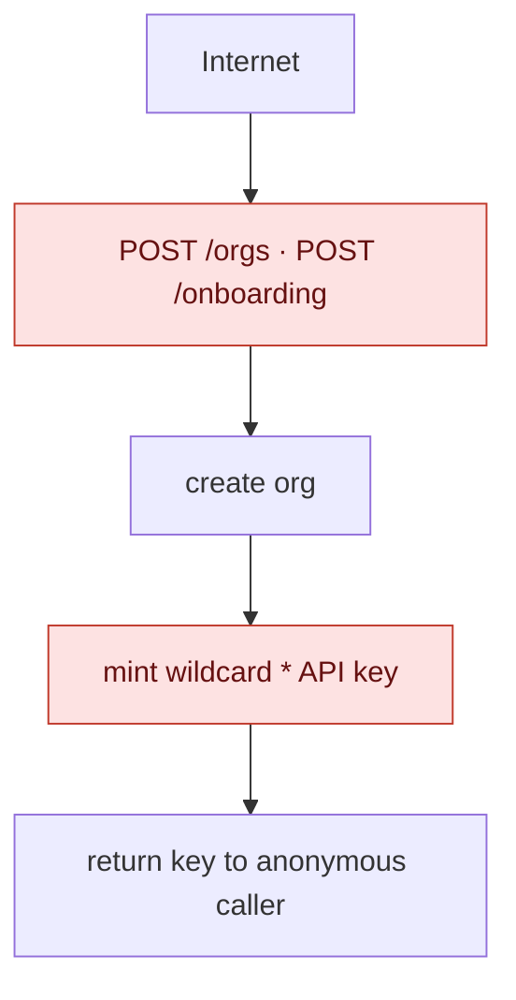
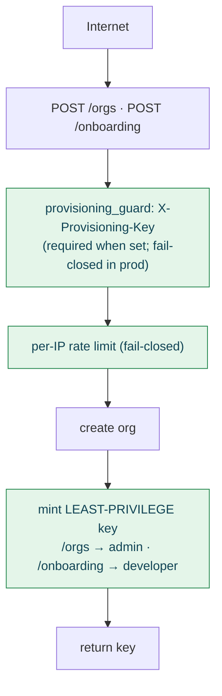

# Tenant provisioning security (S7)

How the unauthenticated tenant-creation endpoints are protected, and why. Resolves finding
**S7** from `docs/reviews/2026-07-founder-review.md`.

## The problem

`POST /v1/orgs` and `POST /v1/onboarding` create an organization and mint its first API key
*before any credential exists*. Authorization (`require_permission` in `keel/deps.py`) cannot
protect them — the exposure happens **before** the RBAC layer runs. As shipped, they were
unauthenticated, unthrottled, and minted a **`["*"]` (full-access) key**:



Left open on a public deployment, anyone could script unlimited orgs and unlimited
full-access keys — resource/cost exhaustion, and every key an admin credential.

## The fix



Three independent controls (`keel/provisioning.py`, applied via `dependencies=[...]` on both
routes):

### 1. Provisioning secret (env-aware, fail-closed)
Callers must present `X-Provisioning-Key: <secret>` matching `KEEL_ONBOARDING_SECRET`
(constant-time compare). Behaviour when the secret is **unset**:

| Environment (`KEEL_APP_ENV`) | No secret configured |
| --- | --- |
| `prod` / `production` / `staging` | **Disabled — `503`** (fail-closed) |
| anything else (`dev`, tests, …) | Allowed (backward-compatible bootstrap) |

So a production deploy that forgets to configure the secret cannot accidentally expose open
onboarding, while local dev and the existing test fixtures keep working with no secret.

### 2. Per-IP rate limit (fail-closed)
A Redis token bucket keyed by client IP, `KEEL_ONBOARDING_RATE_LIMIT_PER_HOUR` (default `10`).
Unlike the authenticated scan limiter (`keel/rate_limit.py`, which fails **open** to avoid a
tenant-wide outage when Redis is down), this anonymous abuse surface **fails closed** — if the
limiter store is unreachable the request is rejected (`503`). Exceeding the limit returns `429`
with `Retry-After`.

> IP note: the address comes from `request.client` or the first `X-Forwarded-For` hop. Without
> a trusted-proxy configuration, XFF is caller-controlled — so the secret is the primary
> control and the rate limit is defence-in-depth.

### 3. Least-privilege initial keys
No endpoint mints `["*"]` any more:

| Endpoint | Role | Scopes | Rationale |
| --- | --- | --- | --- |
| `POST /orgs` | `admin` | `read, write, scan, admin` | The org's administrative root — can manage its own keys. Explicit scopes, not the `*` wildcard (which would also grant any future scope). |
| `POST /onboarding` | `developer` | `read, write, scan` | Self-serve tenant can register agents, author policies, and run scans, but **cannot** manage keys or the org. `admin` is a separate, deliberate escalation. |

## Configuration

```bash
# Enable and require the provisioning secret (required in production)
export KEEL_ONBOARDING_SECRET="<a long random string>"
# Optional: per-IP hourly ceiling on tenant creation (default 10)
export KEEL_ONBOARDING_RATE_LIMIT_PER_HOUR=10
```

## API

Both endpoints now accept the header and can reject before creating anything:

```
POST /v1/onboarding
Header: X-Provisioning-Key: <secret>     # required when KEEL_ONBOARDING_SECRET is set
Body:   { "organization_name": "Acme" }

201 → { organization_id, api_key (developer-scoped), next_steps }
403 → invalid or missing X-Provisioning-Key
429 → per-IP rate limit exceeded (Retry-After header)
503 → provisioning disabled (production, no secret) or rate-limiter offline
```

## Tests

`tests/test_provisioning.py` covers: anonymous rejected when a secret is configured; valid
secret succeeds; wrong secret rejected; production-without-secret disabled (`503`);
dev-without-secret still allowed; the onboarding key is forbidden on admin routes while the
bootstrap key can manage keys; and per-IP rate-limit enforcement.

## Residual / follow-ups

- **S3 (separate):** the authenticated scan limiter still fails **open** on Redis error. That is
  a deliberate availability trade-off for tenants; revisit alongside alerting.
- Richer signup (invite tokens, email verification, OAuth) can layer on top of — or replace —
  the shared secret without changing the endpoints' contract.
